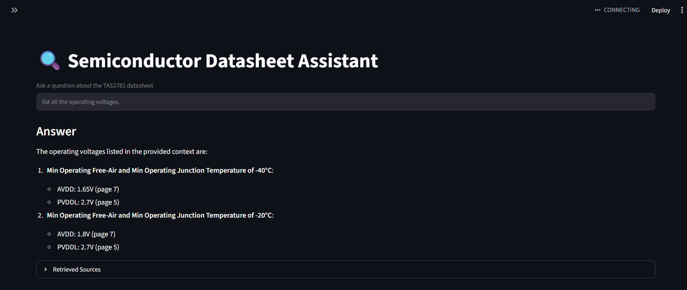

# Semiconductor Datasheet Assistant

A Retrieval-Augmented Generation (RAG) application that allows users to ask natural language questions about semiconductor datasheets.

The system extracts information from semiconductor datasheets, generates vector embeddings, stores them in ChromaDB, retrieves relevant sections through semantic search, and uses a local LLM via Ollama to generate grounded answers.
---

## Features

- PDF Datasheet Ingestion
- Section-based Chunking
- ChromaDB Vector Database
- BGE Embeddings
- Local LLM using Ollama
- Streamlit Web Interface
- Source Attribution (Page Number & Section)

---

## Tech Stack

- Python
- LangChain
- ChromaDB
- HuggingFace Embeddings
- Ollama
- Qwen 2.5
- Streamlit
- PyMuPDF

---

## Project Structure

```text
project/
│
├── docs/
│   └── tas2781.pdf
│
├── db/
│   └── chroma_db/
│
├── ingestion_pipeline.py
├── rag_chatbot.py
├── app.py
├── requirements.txt
└── README.md
```

---

## Installation

### Clone Repository

```bash
git clone <your-repository-url>
cd project
```

### Create Virtual Environment

```bash
python -m venv venv
```

### Activate Environment

**Windows**

```bash
venv\Scripts\activate
```

### Install Dependencies

```bash
pip install -r requirements.txt
```
## Ollama Setup

Download Ollama:

https://ollama.com

Pull the model:

```bash
ollama pull qwen2.5:3b
```

Start Ollama:

```bash
ollama serve
```

## Build Vector Database

Place the datasheet PDF inside:

```text
docs/
```

Run:

```bash
python ingestion_pipeline.py
```

This will:

- Load PDF
- Split into sections
- Generate embeddings
- Store vectors in ChromaDB

Run CLI Chatbot
```bash
python rag_chatbot.py
```

Example:

Ask a question:
What is pin 23 used for?
Run Streamlit App
streamlit run app.py
Example Questions
What is pin 23 used for?
What are the absolute maximum ratings?
What is the PVDDH operating range?
What are the ESD ratings?
What is the maximum sample rate?

## Sample Output

**Question:**

What is pin 23 used for?

**Answer:**

Pin 23 is used for Address detect. The resistor value at this pin selects the I2C address.



Future Improvements
Multi-datasheet support
Hybrid Search (BM25 + Vector Search)
Re-ranking
Conversation Memory
Datasheet Comparison
Table Extraction
Image and Diagram Retrieval

## Author

**Priya Dharshini**

Machine Learning and AI Enthusiast